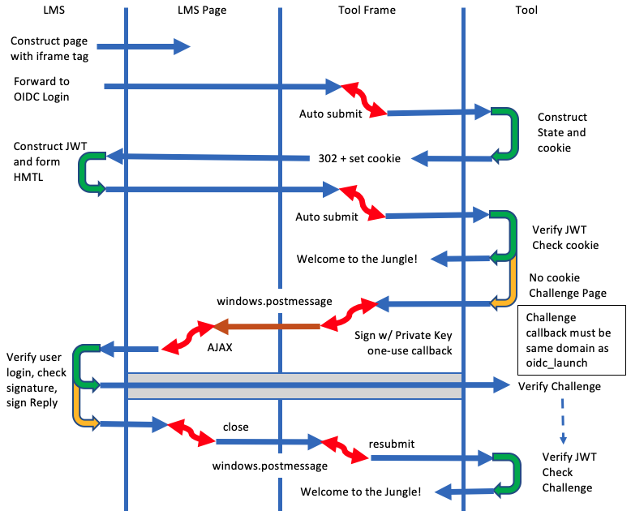

var md=`

<section>

<h2 id="introduction">Introduction</h2>

This proposal seeks to secure the LTI 1.3 launch from a MITM attack
where the JWT is intercepted and transported to another browser and
submitted in that other browser.  This was the problem identified
as part of the original LTI 1.3 development and the OIDC Connect and
OIDC login end point was added to the spec to solve this.

OIDC Connect as we designed has become untenable inside of an iframe
because browser manufacturers have begun blocking all cookies in iframes.

This proposal adds a post-launch verification steps that insure theat
the same user is sitting at the browser *after* the JWT is received 
and signature checked.  This proposal reviews the current problems and 
proposes several variants of a solution to the problem.

This proposal assumes that we are **going to support the in-frame use case**.

</section>

<h3 id="outline">Outline</h3>

* A suggested solution and a transition plan for LTI 1.3

<h2 id="evolution">An evolutionary solution</h2>

This appproach tries to minimizes the delta between LTI 1.3 launch flow and 
a more secure version of that launch but without requiring cookies.  The
changes that wil be resuired will be minimized and surgical and no new data model
items will be required.

The basic idea is that we go through the OIDC login flow and the tool
attempts to set a cookie.   Then the tool receives the launch and it if finds
its cookie - then flow proceeds normally.

But the LMS has added a "validation" endpoint claim in the launch - and if
the tool does not see its cookie along with the launch - it can use its private key
and sign a challenge which is sent to the LMS through postmessage and AJAX.  The 
LMS checks with the public key of the tool and checked the identity of the user
to verify that the same user is still logged into the browser.

If both of these checks pass, the LMS signs a "validated" response with 
its private key and the response is sent directly back to the tool
validation end point.  

When the tool receives a validated response at at the validation endpoint,
it verifies its signature and content using the LMS public key and if the JWT
is valid, the session is marked as "valid".

Once the data has been sent to the validation endpoint,
the LMS sends an 'org.imsglobal.lti.close' postMessage to trigger the
launch endpoint inside the iframe to re-check the launch and see if
it was validated.

This approach works with or without cookies.  Also allows the tool
to decide if it wants
to use something other than cookies if it so desires.   The LMS provides
the post launch validation end point and the tool can evolve over time to use
the post launch validation.

Some tools are using browser signatures instead of cookies (because they work)
and this would allow a seamless autodetected evolution that allows LMS's and tools
to upgrade indepenently and keep working.

`;
